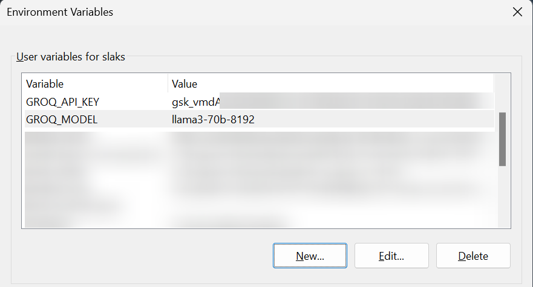

# GROQ-CLI

A simple GO CLI tool using GROQ API and Charm.sh libraries

## Installation

```sh
  go mod tidy
  go run .

```

OR use the binary in the repo

OR `go build .`

## Env variables

- Rename .env.example to .env and configure the values
- OR configure GROQ_API_KEY and GROQ_MODEL env variables

- For windows:
  

## Usage

https://github.com/PR4S4D/groq-cli/assets/20255076/babfd68e-6b41-4cf0-a368-1301a93d7328
